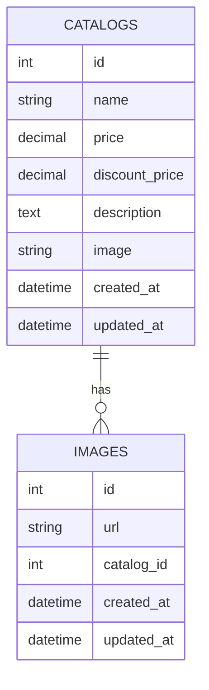

<h1 align="center">
  
  <br />
  <b>Maktabk</b>
  <br />
  <small>Modern Office Furniture E-commerce</small>
</h1>

<p align="center">
  
  
  
</p>

<p align="center">
  <a href="#-features">Features</a> •
  <a href="#-pages">Pages</a> •
  <a href="#-tech-stack">Tech Stack</a> •
  <a href="#-installation">Installation</a> •
  <a href="#-contributing">Contributing</a>
</p>

---

## 🚀 Overview

**Maktabk** is a modern, responsive e-commerce platform focused on office furniture—especially chairs! Built with Laravel, it delivers a seamless, stylish shopping experience with a focus on usability and performance.

---

## ✨ Features

- 🛒 **Session-based Cart**: Add, update, and remove items with real-time price updates.
- 💸 **Discounts & Savings**: Clear price display with discount indicators and savings calculation.
- 📦 **Product Management**: Multiple images, detailed descriptions, and easy catalog browsing.
- 🔍 **Smart Search**: Fast, relevant product search with instant results.
- 📧 **Email Notifications**: Order confirmations and contact form emails with beautiful templates.
- 🌐 **RTL & Responsive**: Fully responsive and RTL-ready for a global audience.
- 🎨 **Modern UI**: Clean design, smooth hover effects, and a delightful user experience.

---

## 🖥️ Pages

| Page                | Description                                                                                 |
|---------------------|---------------------------------------------------------------------------------------------|
| **Home** `/`        | Hero video, featured product, image gallery, and key benefits                               |
| **Catalog** `/catalog` | Product grid with images, prices, discounts, and "Buy" buttons                        |
| **Product** `/product/{id}` | Large gallery, pricing, quantity selector, reviews, and warranty info           |
| **Cart** `/cart`    | Order summary, editable product list, total calculation, and empty cart state               |
| **Search** `/search`| Instant search, results grid, and "No results found" state                                  |
| **Contact** `/contact` | Contact form and company info                                                          |
| **Checkout** `/checkout` | Secure checkout process                                                             |

---

## 🗄️ Database Structure



---

## 🛠️ Tech Stack

- **Backend:** Laravel (PHP 8.x)
- **Database:** MySQL / MariaDB
- **Frontend:** Blade, HTML5, CSS3, JS
- **Package Manager:** Composer

---

## ⚡ Installation

```bash
# 1. Clone the repository
git clone https://github.com/yourusername/maktabk.git

# 2. Install dependencies
composer install

# 3. Set up environment
cp .env.example .env

# 4. Generate app key
php artisan key:generate

# 5. Run migrations
php artisan migrate

# 6. Start the server
php artisan serve
```

---

## 🤝 Contributing

We welcome contributions! Please read our contributing guidelines before submitting a pull request.

---

## 📜 License

MIT License © 2025 Maktabk Team
